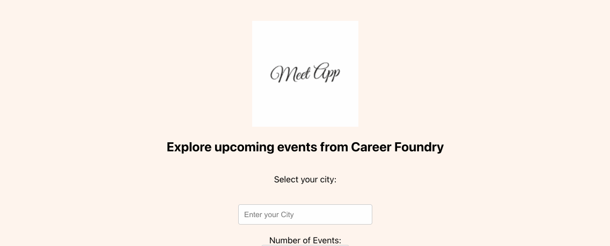

## Meet App



Meet App is a *serverless*, *progressive web application* (PWA) built with **React** using a *test-driven development* (TDD) technique. The application uses the **Google Calendar API** to fetch upcoming events and the serverless function is *hosted by a cloud provider (AWS)*. In addition, the application offers *data visualisation* using the **Recharts** library.

Please click [this link](https://molleira.github.io/meet/) to check the application.

### About
Serverless and PWAs have grown in popularity over the last few years, and they’re both considered to be the future of web development. By combining these two concepts, the app works as a normal web application, but it also reaps the benefits of both serverless architecture and PWAs:

- Serverless: No backend maintenance, easy to scale, always available, no cost for idle time.
- PWAs: Instant loading, offline support, push notifications, “add to home screen” prompt, responsive design, and cross-platform compatibility.

I also used a TDD approach, writing tests before writing the actual functionality of the app in code. Writing tests forced me to focus on the requirements of the application before jumping into the code. TDD relies on the repetition of a very short development cycle, and it allowed me to get immediate feedback and deliver high-quality code.

Last but not least, I've added some graphs, which make it more visually appealing and allows to more easily draw conclusions from the data.

### Development
To run this project locally, run the following command, then navigate to the localhost port stated in your terminal.
```
npm run serve
```

In the future I intend improve the UI to make it even more attractive and easy to use. Before that, I plan to fetch data from other calendars in order to create a more exhaustive platform.

### Usage
Please let me know if you would like to use this project as a template to create your own. I'll be happy to get in touch and help with whatever you need.
